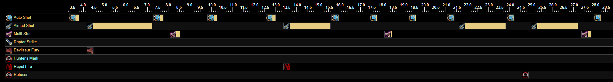
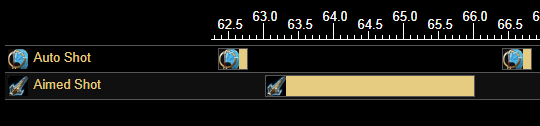
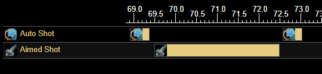

# Hunters: A Supplementary Guide

This is a collection of resources for Classic WoW Hunters.  It is not a pre-60 guide, nor a pre-BiS gear list, you should find those at [wowhead](https://classic.wowhead.com/guides/classic-wow-hunter-class-overview) or [icy veins](https://www.icy-veins.com/wow-classic/hunter-dps-pve-guide).  There is a lot of misinformation about hunters in Classic Wow--hopefully this document can give you the information you need to come to your own conclusions.  A few things to note before going further:
- Sim(ulate): simming is the best way to get answers about your current situation.  The [hunter sim](https://docs.google.com/spreadsheets/d/1BIlB2P1kyV_QdD4ULQzvZvS6hK6BDouUQkyHQzCvBGI/edit?usp=sharing) should be treated as gospel and is made by people smarter than you or I.  If you have an issue with the sim (or a question in general):
- The [Classic WoW Hunter Discord](https://discord.gg/8TVHxRr) is the best place to quickly sort out all kinds of issues.


## Table of Contents
- [Talents](#talents)
  - [Raid Viable PvP Talents](#raid-viable-pvp-talents)
- [Rotations](#rotations)
  - [Clipping](#clipping)
  - [Openers](#openers)
  - [Melee Weaving](#melee-Weaving)
- [Mechanics](#mechanics)
  - [Macros](#macros)
  - [Weak Auras](#weak-auras)
- [Buffs](#buffs)
- [Pets](#pets)
- [Gear](#gear)
  - [T2](#t2)
  - [Rings](#rings)
  - [Ranged Weapons](#ranged-weapons)
  - [Nature Resist Gear for AQ](#nature-resist-gear-for-aq)
- Farming
  - [Dire Maul Tribute](#dire-maul-tribute)


## Talents

Trueshot Aura is king.  If you're in a raid which does not currently have TS in every melee group then you should spec 31 marksman for it.  Hunters do not gain enough DPS from any other talent spec to justify not giving 100 AP to your 4 party members.
<!-- If you were not previously aware, this might be the first indicator that hunters are really not a core damage class in classic-- we are a ranged support class which kites and tranqs ;). -->

I would recommend [2/31/18](https://classicdb.ch/?talent#cbZViohthtI0rroh) if not hitcapped from gear (taking 3/3 Surefooted for the hit) or [17/31/3](https://classicdb.ch/?talent#cE000xbZViohthth) for some added pet damage if hitcapped.  Points can be moved away from Improved Hunter's Mark if someone else in your raid has it-- or if your raid is debuff capped and not using it.

Survival and Beast Mastery can do more damage than Marksman if invested into, at the cost of TS aura.  If you do not need to provide your raid with TS aura, consider other a talent spec other than MM.

### Raid Viable PvP Talents

Hunters can take a very viable PvP/MM spec to raid.  After taking [31 in MM](https://classicdb.ch/?talent#cZgVohtht), you can put points into Improved Aspect of the Hawk for some ranged DPS haste.  If you want to skew harder to PvP, skip that and go straight to the survival tree.

- Monster Slaying and Humanoid Slaying are clear choices for BWL and PvP respectively.  
- Entrapment is extremely strong for group PvP like BGs since at 5/5 it has a 25% chance to snare enemies in Frost Traps _every tick._  It can cause some weird aggro glitches and mess with pulls like the Goblin Technicians in BWL.
- Savage Strikes is mandatory for melee weaving in raids and helps make quick work of anyone in melee range.  
- Improved Wing Clip is strongest in a duel setting.
- Clever Traps synergizes strongly with Entrapment.
- Survivalist could be good in duels but doesn't offer as much as the other talents in this tree.
- Deterrence is an incredible PvP cooldown for 1 talent point.  Do not cast this when duelling a warrior.
- Trap Mastery is good.
- Surefooted is mandatory if you are not hitcapped.  The CC resist chance is also nice for PvP.
- Improved FD is good for [Dire Maul Tribute](#Dire-Maul-Tribute) runs and avoiding FD resists on bosses if you are performing active trinket [openers](#Openers).  Do not take this if you are not doing either of those.

## Rotations

With even crit RNG, hunters do around half of their damage from Auto Shot.  Their rotation, then, is about weaving in Aimed Shot and Multishot with minimally disrupting their Autos.

You should start with `Auto - aimed - auto - multi -...` and then cast aimed and multi off cooldown with an auto between them.  After 3 cycles both Aimed and Multishot wil come off cooldown at the same time: **always prioritize aimed.**  If you `mutli - auto - aimed -...` their CDs will stay synchronized and you will be delaying your Aimed Shot every time for a damage loss.

### Clipping

The math used to calculate Aimed Shot's damage mostly ignores weapon speed and so two different weapons with the same DPS but different attack speeds will do very similar Aimed Shot damage.  However, the faster weapon will do less damage for each auto.  Because of this, we prioritize Aimed Shots over Auto Shots for weapons with an attack speed less than 3.  This means that you should cast Aimed Shot on CD even if it means interrupting a partially cast Auto Shot: this is called clipping.

Clipping fast attack speed weapons yields a DPS boost but will drain mana faster.  See [Ranged Weapons](#ranged-weapons) for specifics of whether you should clip a given weapon. 

### Openers

If your normal rotation is now just muscle memory and you happen upon some trinkets, its time to consider openers.  If you only have [Devilsaur Eye](https://classic.wowhead.com/item=19991/devilsaur-eye), then use it with Rapid Fire _before_ your first Aimed Shot and then go about your rotation normally.

If you do not yet have Devilsaur Eye and plan on getting exalted with Cenarian Circle, then you may want to consider getting [Devilsaur Tooth](https://classic.wowhead.com/item=19992/devilsaur-tooth) instead.  [Earthstrike](https://classic.wowhead.com/item=21180/earthstrike) is a phase 5 trinket from CC rep which outclasses Devilsaur Eye whereas Devilsaur Tooth is a BiS BM trinket into TBC.  That being said, hunters are capable of using as many trinkets as a fight's length allows via switching trinkets after Feign Death-- it is plausible that using both Devilsaur Eye and Earthstrike may be viable.

#### Renataki's and Devilsaur Eye

The optimal opening for [Renataki's Charm of Beasts](https://classic.wowhead.com/item=19953/renatakis-charm-of-beasts), [Devilsaur Eye](https://classic.wowhead.com/item=19991/devilsaur-eye), and Rapid Fire is as follows:



`Auto - DE and Aimed - rotation until Aimed is off CD - RF and Aimed - rotation until Aimed is off CD - Aimed - use Renataki's - FD and swap to passive trinkets - Aimed - Multi - Auto - into rotation.`

Using DE puts Renataki's on a 20s CD.  We delay using Rapid Fire so that it hastes 3 Aimed Shot (from the Rena reset). There is a 3 second timer after FD in which you cannot Auto Shot.  Because of this, if you FD and cast Aimed Shot after it and the Aimed Shot is hasted, you should cast Multishot immediately following it since you still won't be able to Auto.

*[This information, along with a useful macro, comes from Skinnay.](https://gist.github.com/skinnay-dev/0ce6448cc5f9e74336a096eb60708a99)*

### Melee-Weaving

WIP: go [here](https://classicwow.live/guides/1914/raptor-strike-and-you-a-detailed-analysis-and-guide-to-melee-weaving) for now.

## Mechanics

If an effort the recreate the low tickrate feeling of vanilla WoW, Blizzard added two mechanics which effectively delay hunters' attacks: spell batching is well defined by a number of resources and affects hunters; the retry timer is unique to ranged attacks and has an immense impact on hunter mechanics and macros.

### Retry Timer

[This forum post](https://us.forums.blizzard.com/en/wow/t/classic-hunter-the-retry-timer/542470) gives a full explaination, but the TLDR is that a .5 second timer is started when an Auto Shot is attempted but cannot be performed.  This happens if you are moving, not in LoS of your target, out of range, or are casting a different spell (like Aimed Shot).  At the end of the .5 second retry timer, the server will check if you can perform your auto shot: if you can, it will send the attack, otherwise it will start the retry timer again.

If you cast Aimed Shot normally, this causes a meaningful delay of the following Auto Shot since it attempts to Auto during your aimed and starts the retry timer:



Casting Aimed Shot immediately after your auto, and stopping your Auto during your aimed dramatically tightens up your attacks:



You don't (and shouldn't) have to do this manually.  The following macro will cast your Aimed Shot and stop the retry timer from adding a delay to your attacks:

```
#showtooltip
/cast Aimed Shot
/cleartarget
/targetlasttarget
```

### Macros

WIP check [here](https://classicwow.live/guides/893/hunter-macros-tips); **NOTE, many of these macros do not have the cleartarget, targetlasttarget lines required to avoid auto shot delay.**  I'm working on going through them.

<!-- https://pastebin.com/FzG7CtR0 Zeroji's -->

### Weak Auras

Weak Auras (2) is an addon which adds customizable UI elements.  Hunters have a handful of very helpful WAs:
- [Smarnz's Improved Range Check](https://wago.io/-EGVBCgFU) shows your range to a target.
- [Stokbaek's Castbar for Multi/Aimed with Pushback](
https://wago.io/92y4H96_t) is a castbar with estimated pushback.  Hunters should have at least one castbar/shot timer; this one is nice.
- Optional, but [this WA](https://wago.io/oYIjS228K) shows your shot delays so that you can tighten your rotation.
- [Weaving Timer Collection](https://wago.io/oBjregGjL) shows the timings of all components of your weave.
- [Predictive Weave Bar](https://wago.io/K6nl2clmn) is insane.
- [Tranq Shot Tracker](https://wago.io/GaRv7KK51/1) tracks tranq shots.
- [Instance History](https://wago.io/OXlZupyKm/6) for tracking your instance lockouts.
<!-- https://wago.io/FX0Q1REGv -->


## Buffs

Hunters get the short end of the buff stick.  Dire Maul Tribute's [Fengus' Ferocity](https://classic.wowhead.com/spell=22817/fengus-ferocity) is only melee AP.  Battle Chicken's [squak](https://classic.wowhead.com/spell=23060/battle-squawk) is only melee attack speed.  These buffs are only useful if you are melee weaving.  Hell, even the AP component of [Rallying Cry of the Dragonslayer](https://classic.wowhead.com/spell=22888/rallying-cry-of-the-dragonslayer) is only melee (luckily the crit does affect ranged attacks).

### Consumables
<!-- agi scroll, juju power, juj might -->
There are many guides for hunter consumes so I'm not going to recreate them here.  Just note: there are consumes for your ranged attacks, consumes for buffing your pet (yes, it makes a significant DPS increase), and consumes for melee weaving.

If nothing else, try to have [Elixir of the Mongoose](https://classic.wowhead.com/item=13452/elixir-of-the-mongoose) and [Grilled Squid](https://classic.wowhead.com/item=13928/grilled-squid) with you at all times.  [Greater Fire Protection Potion](https://classic.wowhead.com/item=13457/greater-fire-protection-potion) are key to protecting your Aimed Shot from suffering pushback on Firemaw, Vael, etc.


## Pets

Pets can do a considerable percentage of a hunter's damage even if they are not Beast Mastery hunters.  All hunters should focus on keeping their pet alive (pet uptime).  Hunters raiding BWL and MC should take the following pet skills to maximize damage: max fire resist, max shadow resist, max dash, max claw, rest in stamina.

## Gear

[Simming](https://docs.google.com/spreadsheets/d/1BIlB2P1kyV_QdD4ULQzvZvS6hK6BDouUQkyHQzCvBGI/edit?usp=sharing) is the only way to answer the question of "should I wear X or Y?"  Gear guides can tell you what to pursue, but simming is the end all for making the best of what you have.  For ally hunters, Skinnay already has a [list of simmed gear sets](https://gist.github.com/skinnay-dev/39f71f3cce1c64b95142f7e0e0d97bca).

Its notable that stat priorities change dramatically depending on your faction and rotation.  Alliance members will favor stats like Agi which are increased by kings and weavers will take notably worse weapons for ranged DPS so that their raptor strikes hit harder.

### T2

The T2 8 piece set bonus debuff has a proc rate of .5 ppm.  It takes up a debuff slot per proc; [if multiple procs overlap, it takes up multiple debuff slots.](https://classic.warcraftlogs.com/reports/zw8FcCnL19qxjhmR#hostility=1&type=auras&spells=debuffs&ability=23577&source=100&fight=last)  Each hunter wearing T2 in a raid slightly increases every other hunters DPS.

### Rings


TLDR: rings without hit are better than rings with hit.  If you can afford to drop hit from your ring, probably do it.  Sim is still the best way to tell.

### Ranged Weapons

Hunter's ranged weapons are poorly described by tooltips.  DPS numbers are often misleading as slower weapons will do much better damage than faster ones.  Below is a list of hunter weapons tiered by their DPS for a tier 2 MM hunter and whether the weapons should be clipped.  Please be informed-- it is not worth taking a Striker's Mark or something similar from a melee when a blue dungeon weapon is better.

| Weapon | AS | Best DPS | Worst DPS | Auto DPS |
|--------|--------------|----------|-----------|----------|
| Nerubian Slavemaker | 3.2 | 599, Full |  503, Clipped | 304 (1st) |
| Ashjre’thul | 3.4 | 571, Full | 491, Clipped | 283 (9th) |
| Larvae of the Great Worm | 3.0 | 558, Clipped | 530, Full | 290 (3rd) |
| Soulstring | 2.9 | 551, Clipped | 534, Full | 293 (2nd) |
| Crossbow of Imminent Doom | 3.1 | 547, Clipped | 507, Full | 276 (13th) |
| Rank 14 Weapons | 2.9 | 538, Clipped | 521, Full | 285 (8th) |
| Rhok’delar | 2.9 | 534, Clipped | 517, Full | 282 (10th) |
| Fahrad’s Reloading Repeater | 3.2 | 530, Full | 447, Clipped | 261 (22nd) |
| Bloodseeker | 3.3 | 528, Full | 451, Clipped | 259 (23th) |
| Huhuran’s Stinger | 2.7 | 525, Full | 517, Clipped | 286 (6th) |
| Blessed Qiraji Musket | 2.6 | 525, Full | 506, Clipped | 286 (6th) |
| Carapace Spine Crossbow | 3.3 | 523, Full | 447, Clipped | 257 (26th) |
| Dragonbreath Hand Cannon | 2.8 | 521, Clipped | 516, Full | 281 (11th) |
| Heartstriker | 2.6 | 516, Full | 498, Clipped | 280 (12th) |
| Flawless Arcanite Rifle | 3.0 | 510, Clipped | 482, Full | 233 (28th) |
| Striker’s Mark | 2.5 | 509, Full | 480, Clipped | 274 (14th) |
| Gurubashi Dwarf Destroyer | 2.8 | 508, Clipped | 503, Full | 272 (16th) |
| Blastershot Launcher | 2.6 | 508, Full | 491, Clipped | 274 (14th) |
| Toxin Injector | 2.0 | 503, Clipped | 498, Full | 290 (3rd) |
| Core Marksman Rifle | 2.5 | 503, Full | 474, Clipped | 270 (18th) |
| Mandokir’s Sting | 2.6 | 502, Full | 484, Clipped | 270 (18th) |
| Hoodoo Hunting Bow | 2.8 | 499, Clipped | 493, Full | 265 (20th) |
| Stoneshatter | 2.9 | 499, Clipped | 482, Full | 258 (25th) |
| Silithid Husked Launcher | 2.8 | 496, Clipped | 490, Full | 263 (21st) |
| Bow of Taut Sinew | 2.2 | 496, Full | 445, Clipped | 272 (16th) |
| Grand Marshal’s Bullseye / High Warlord’s Recurve | 1.8 | 494, Full | 470, Clipped | 287 (5th) |
| Ancient Bone Bow | 2.8 | 490, Clipped | 484, Full | 259 (23rd) |
| Gryphonwing Longbow | 2.7 | 477, Full | 473, Clipped | 254 (27th) |

### Nature Resist Gear for AQ

Most Ally guilds will have hunters soak nature damage during the enrage phase of Princess Huhuran fight in AQ40.  We have Aspect of the Wild which gives 60 nat resist to your party members and can FD for a quick costume change before the phase.  Hunters attempting AQ should prep nature resist sets.  The amount of NR required for hunters should come from your guild, but keeping in mind that soaking requires us to be in melee and we won't do much damage, I'm of the mind that hunters should cap as much nature resist as possible to help out the healers.

- [125 NR](https://sixtyupgrades.com/set/nqsbx2qBpgr2m8oAqDxW3c)
- [165 NR](https://sixtyupgrades.com/set/cYZprxcDzQNCZmVB9ArHu8)
- [215 NR](https://sixtyupgrades.com/set/xatWTfdVrn8ThE1JhrtVpN)
